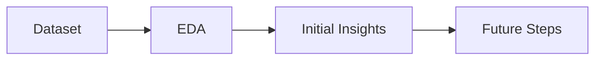

# Compliance Radar
Machine Learning project

## 1. Introduction
This project focuses on understanding organizational compliance, specifically the factors that influence whether a department follows or deviates from company rules. Although the precise rules are not defined, the dataset provides a rich set of operational, structural, managerial, and behavioral indicators that reflect how departments function and how vulnerable they may be to compliance failures.
The main objective of the project is to analyze these indicators to uncover patterns, risk factors, and drivers of non-compliance. By examining both high-risk and standard departments, we aim to identify the organizational characteristics most closely associated with low compliance scores and elevated risk levels.
A secondary goal is to evaluate whether existing internal classifications — such as the high-risk department list — align with measurable compliance performance trends across the organization.

## 2. Project Overview Map

### 3. Dataset description

Before beginning the EDA, the data required significant preparation to ensure accuracy and interpretability:
 1. Variable understanding and feature selection
Each variable was evaluated for its relevance to compliance analysis.
	•	Identification variables (e.g., dept_id, dept_category, division, dept_type) were retained.4

	•	Operational, behavioral, and risk-related indicators were kept, as they may influence compliance levels.

	•	Variables providing no analytical value (e.g., dept_name, creation_reason, secondary_function) were removed early to reduce noise.
 3. Data type corrections
Several binary/boolean fields were stored as objects; these were converted to numeric formats to prevent analytical errors during modeling and statistical tests.
 4. Consistency checks across tables
We verified that all departments listed as high-risk also appeared in the main table. No orphan records were found, and the tables were aligned accordingly.
 5. Integration of high-risk information
To enrich the dataset, we added a binary flag (present_in_high_risk_departments) to the main table, indicating whether a department is listed as high risk. This allows us to examine risk status as a potential predictor of compliance.
 6. Duplicate detection and resolution
The departments table contained both full-row and ID-level duplicates. Because dept_id uniquely identifies a unit, duplicates posed a threat to analytical integrity.
A structured rule-based approach was used:
	•	If duplicates included a high-risk instance, that record was prioritized.

	•	Otherwise, the first occurrence was preserved.

	•	The high_risk_departments table was similarly cleaned by comparing duplicates to their corresponding records in the main table and retaining the best match.

After this data-cleaning workflow, the final dataset contains 682 unique departments with consistent, reliable attributes ready for exploration.
## 4. Exploratory Data Analysis (EDA)
The goal of EDA was to undersand the structure, data quality, and behaviour of the dataset in order to prepare it for modeling and derive early insights about compliance and risk. These are the steps we followed on order to get the logical sequence of work: data structure → data quality → outliers → missingness → correction decisions → feature relationships → multicollinearity → scaling → dimensionality reduction. 

**Dataset Structure and Variable Types**

The departments dataset originally contained 682 rows and 35 columns, mixing:
	•	Categorical variables: identifiers, department types, locations, structures.
  
	•	Numeric variables: scores, risks, experience levels, violations.
  
	•	Boolean/flag variables: program participation, support indicators, etc.

To enable targeted analysis, variables were grouped into:
	•	Categorical
  
	•	Numerical
  
	•	Boolean

This grouping was needed for imputation, plotting, encoding, and model preparation.

**2. Outlier Detection**

Histograms and scatterplots revealed several anomalies:

## 5. Current Findings
(*Only 2–3 early insights — can fill later!*)

## 6. Next Steps
(*Modeling, feature engineering, etc.*)

## 7. Tools & Technologies
(*Python, Pandas, Jupyter, etc.*)

## 8. Ethical Considerations
(*Bias, compliance, privacy*)

## 9. Project Structure
(*How the files are organized*)

## 10. Contributors
(*Your team names*)

Machine Learning project – Compliance Radar
