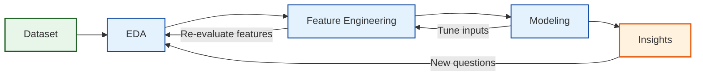

# Compliance Radar
Machine Learning project

## 1. Introduction
This project focuses on understanding organizational compliance, specifically the factors that influence whether a department follows or deviates from company rules. Although the precise rules are not defined, the dataset provides a rich set of operational, structural, managerial, and behavioral indicators that reflect how departments function and how vulnerable they may be to compliance failures.
The main objective of the project is to analyze these indicators to uncover patterns, risk factors, and drivers of non-compliance. By examining both high-risk and standard departments, we aim to identify the organizational characteristics most closely associated with low compliance scores and elevated risk levels.
A secondary goal is to evaluate whether existing internal classifications — such as the high-risk department list — align with measurable compliance performance trends across the organization.

## 2. Project Overview Map

### 3. Dataset description
Before beginning with the EDA, the data required significant preparation to ensure accuracy and interpretability:

 **Data Type Standardization**   
Several variables representing yes/no or true/false information were stored as object types instead of numeric or boolean.
These included columns such as remediation_plan_active, executive_support, external_consulting, and others.
To prevent Pandas errors and ensure proper statistical treatment, all these fields were converted to numeric (0/1).
This ensures consistency across operations like aggregation, plotting, and modeling.

 **Removal of Irrelevant or Non-Useful Columns**
Certain fields did not contribute meaningful information to the analysis or modeling process.
These included descriptive or metadata-only columns such as:
 dept_name
 secondary_function
 creation_reason
 _metadataproject_string
 _metadataacademic_year
Removing these columns reduces noise, simplifies the dataset, and helps avoid accidental data leakage.

**Cross-Table Integrity Check (Department Presence Verification)**
The project uses two main tables:
departments (full population of departments)
high_risk_departments (subset flagged as high-risk)
We validated that every department ID listed as high-risk also appears in the main table.
A mismatch would imply missing data or incomplete records.
We found that all high-risk departments were present, so no restorative steps were needed.
Nevertheless, we filtered high_risk_departments to keep only IDs present in the main table for safety.

**Combining Risk Labels with the Main Dataset**
To integrate information from both tables, we added a new column:
present_in_high_risk_departments, indicating whether each department is high-risk (1) or not (0).
This creates a unified table where risk classification is directly available for modeling and EDA.
The merge was done via a simple membership check using dept_id.

**Duplicate Detection and Handling**
We checked for two types of duplication: Full-row duplicates (identical rows) and duplicate department IDs (dept_id repeated across rows) and since dept_id is the unique identifier for each department, duplicates must be resolved carefully. Some duplicates corresponded to high-risk departments. In these cases, we kept the high-risk version of the row. If both duplicates were high-risk or both were non–high-risk, we kept the first occurrence to maintain consistency. After deduplication, each department appears exactly once, eliminating ambiguity in the dataset.

**Final Outcome**
All boolean values properly formatted. Irrelevant or redundant columns removed. High-risk table fully aligned with the main dataset. Risk labels integrated into the main table. Duplicate rows resolved with priority rules. 
The dataset is now clean, consistent, and ready for reliable EDA and modeling.

## 4. Exploratory Data Analysis (EDA)

Before performing modeling or statistical interpretation, we conducted an Exploratory Data Analysis (EDA) to better understand the structure, quality, and behavior of the dataset.
EDA helps us to detect data quality issues, as well as identifying outliers and unusual patterns that may distort modeling, understand variable distributions (skewness, extreme values, clustering), verify assumptions about numerical, categorical, and boolean variables, and prepare the dataset for preprocessing and feature engineering.
Because ML models rely heavily on clean, correctly formatted data, EDA is a critical step before modeling.

  **Dataset Shape & Variable Types**
We first inspected the dataset structure:
The departments table contains 682 rows and 35 variables.
Data types were reviewed to ensure correct classification:
Categorical variables are mostly department identifiers and descriptive labels,
numerical variables are continuous measures used in risk assessment, and 
boolean variables are originally stored as objects; previously converted to numeric (0/1)

This split allows domain-specific handling of each variable type during EDA operations, such as financial indicators, employee engagement, and risk/compliance metrics.

  **Numerical Summary**
Summary statistics
We computed .describe() on all numerical variables in order to examine:
 1. Central tendency (mean, median).
 2. Dispersion (std, min, max, quartiles).
This guided our search for implausible values and extreme outliers.

  **Outlier handling**
  
Outlier analysis was an important step in our EDA because several key variables are scores on bounded scales (e.g. audit scores, risk scores). Values far outside the expected range are more likely to be data entry errors than genuine observations and can heavily distort models. 
For all numerical variables in numerical_cols, we plotted histograms with KDE overlays. This allowed us to:

 -Check that most values fall into sensible ranges.
 
 -Spot isolated values far away from the bulk of the distribution.
 
 -Identify which variables needed more detailed inspection.
 
From this step, three variables clearly stood out:
   -audit_score_q1
   
   -overall_risk_score
   
   -compliance_score_final

Observed values for audit_score_q1 clearly below 30, which is unrealistic for this scoring context. These outliers were treated as erroneous and set to NaN.
Some values for overall_risk_score were > 100, which is impossible for a 0–100 risk scale. All values > 100 were set to NaN.
Very low values for compliance_score_final, values < 20 are rare but valid within [0, 100].
That is why instead of removing them, we flagged them as:
extreme_non_compliance = 1 if compliance_score_final ≤ 20.

(Here you might add one scatter plot showing outliers before/after cleaning.)
3.4 Logical Consistency Checks
We checked cross-variable consistency, especially between audit and compliance scores.
Rule examined:
If audit scores exist (Q1 or Q2), the final compliance score should also exist.
We found 22 inconsistent rows where:
compliance_score_final is missing
but at least one of audit_score_q1 or audit_score_q2 is present.
Of these, 8 departments are flagged as high risk.
These 8 were kept, and we added a flag:
audit_scores_missing = 1 for them.
The remaining 14 rows (non–high-risk) were dropped as inconsistent and low-value.
3.5 Missing Data Analysis
Overall missingness
Many columns had 36–43% missing values in the raw departments table.
Key ID variables (dept_id, dept_category) are complete, which allowed us to:
Group by category
Study patterns in missingness
Missingness by dept_category
We computed missing counts and rates by dept_category.
Pattern observed:
Operational_Compliance departments have very high missingness (≈ 83%).
Financial_Reporting and Risk_Management have much better data completeness (≈ 8–9%).
Interpretation:
Missingness is structural: departments dealing with Operational Compliance rules systematically did not submit their data.
Missingness by division
At first glance, Corporate_HQ seemed to have more missing data, but:
That was driven by the much larger number of departments.
When we looked at percentages, Corporate_HQ and Regional_Operations had similar missingness (~9%).
Rows with missing division showed:
~100% missingness for almost all analytical columns.
Perfect overlap with Operational_Compliance category.
Conclusion:
Rows with missing division:
Cannot be recovered (almost fully empty).
Do not systematically correspond to high-risk departments.
👉 We dropped all rows with missing division from both departments and high_risk_departments.
3.6 Is Missingness Related to Risk or Compliance?
We tested whether rows with more missing values are inherently riskier or less compliant.
Defined row-level missingness rate (% missing across analytical columns).
Correlated it with:
compliance_score_final: correlation ≈ 0.035
overall_risk_score: correlation ≈ 0.019
Interpretation:
Both correlations are essentially zero.
Departments with more missing data are not systematically more or less risky/compliant.
Supports our decision to drop fully missing rows without biasing the outcome.
(If you like, you can include one heatmap of missingness to illustrate structure.)
3.7 Missing Data Imputation: Two Procedures
We tested two imputation strategies for departments and high_risk_departments:
Procedure 1 – High-risk-aware imputation
For departments that appear in both tables:
Use values from high_risk_departments to fill missing fields in departments when available.
For remaining missing values:
Numerical → median.
Categorical / boolean → mode.
Apply the same median/mode rules to high_risk_departments.
Procedure 2 – Pure statistical imputation
Ignore cross-table copying.
For both tables:
Numerical → median.
Categorical / boolean → mode.
Comparison
We compared:
Row-level similarity between corresponding departments.
Division-level statistics (e.g., average compliance, risk scores, violations).
Distribution shapes of numerical variables (histograms).
Result:
Both procedures produced very similar division-level aggregates.
However, Procedure 2 preserved the original distributions of numerical variables more faithfully.
👉 We adopted Procedure 2 for final imputation.

## 5. Current Findings
(*Only 2–3 early insights — can fill later!*)

## 6. Next Steps
(*Modeling, feature engineering, etc.*)

## 7. Tools & Technologies
(*Python, Pandas, Jupyter, etc.*)

## 8. Ethical Considerations
(*Bias, compliance, privacy*)

## 9. Project Structure
(*How the files are organized*)

## 10. Contributors
(*Your team names*)

Machine Learning project – Compliance Radar
