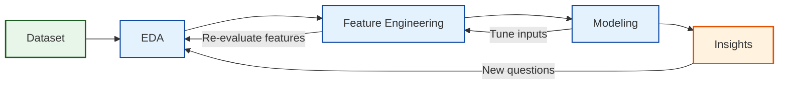

# Compliance Radar
Machine Learning project

## 1. Introduction
This project focuses on understanding organizational compliance, specifically the factors that influence whether a department follows or deviates from company rules. Although the precise rules are not defined, the dataset provides a rich set of operational, structural, managerial, and behavioral indicators that reflect how departments function and how vulnerable they may be to compliance failures.
The main objective of the project is to analyze these indicators to uncover patterns, risk factors, and drivers of non-compliance. By examining both high-risk and standard departments, we aim to identify the organizational characteristics most closely associated with low compliance scores and elevated risk levels.
A secondary goal is to evaluate whether existing internal classifications — such as the high-risk department list — align with measurable compliance performance trends across the organization.

## 2. Project Overview Map

### 3. Dataset description
Before beginning the EDA, the data required significant preparation to ensure accuracy and interpretability:

 **Data Type Standardization**   
Several variables representing yes/no or true/false information were stored as object types instead of numeric or boolean.
These included columns such as remediation_plan_active, executive_support, external_consulting, and others.
To prevent Pandas errors and ensure proper statistical treatment, all these fields were converted to numeric (0/1).
This ensures consistency across operations like aggregation, plotting, and modeling.

 **Removal of Irrelevant or Non-Useful Columns**
Certain fields did not contribute meaningful information to the analysis or modeling process.
These included descriptive or metadata-only columns such as:
 dept_name
 secondary_function
 creation_reason
 _metadataproject_string
 _metadataacademic_year
Removing these columns reduces noise, simplifies the dataset, and helps avoid accidental data leakage.

**Cross-Table Integrity Check (Department Presence Verification)**
The project uses two main tables:
departments (full population of departments)
high_risk_departments (subset flagged as high-risk)
We validated that every department ID listed as high-risk also appears in the main table.
A mismatch would imply missing data or incomplete records.
We found that all high-risk departments were present, so no restorative steps were needed.
Nevertheless, we filtered high_risk_departments to keep only IDs present in the main table for safety.

**Combining Risk Labels with the Main Dataset**
To integrate information from both tables, we added a new column:
present_in_high_risk_departments, indicating whether each department is high-risk (1) or not (0).
This creates a unified table where risk classification is directly available for modeling and EDA.
The merge was done via a simple membership check using dept_id.

**Duplicate Detection and Handling**
We checked for two types of duplication: Full-row duplicates (identical rows) and duplicate department IDs (dept_id repeated across rows) and since dept_id is the unique identifier for each department, duplicates must be resolved carefully. Some duplicates corresponded to high-risk departments. In these cases, we kept the high-risk version of the row. If both duplicates were high-risk or both were non–high-risk, we kept the first occurrence to maintain consistency. After deduplication, each department appears exactly once, eliminating ambiguity in the dataset.

**Final Outcome**
All boolean values properly formatted. Irrelevant or redundant columns removed. High-risk table fully aligned with the main dataset. Risk labels integrated into the main table. Duplicate rows resolved with priority rules. The dataset is now clean, consistent, and ready for reliable EDA and modeling

## 4. Exploratory Data Analysis (EDA)

Before performing modeling or statistical interpretation, we conducted an Exploratory Data Analysis (EDA) to better understand the structure, quality, and behavior of the dataset.
EDA helps us to detect data quality issues (wrong data types, missing values, duplicates), identify outliers and unusual patterns that may distort modeling, understand variable distributions (skewness, extreme values, clustering), verify assumptions about numerical, categorical, and boolean variables, and prepare the dataset for preprocessing and feature engineering.
Because ML models rely heavily on clean, correctly formatted data, EDA is a critical step before modeling.

  **Dataset Shape & Variable Types**
We first inspected the dataset structure:
The departments table contains 682 rows and 35 variables.
Data types were reviewed to ensure correct classification:
Categorical variables are mostly department identifiers and descriptive labels
Numerical variables are continuous measures used in risk assessment
Boolean variables are originally stored as objects; previously converted to numeric (0/1)

This split allows domain-specific handling of each variable type during EDA.operations, financial indicators, employee engagement, and risk/compliance metrics.

## 5. Current Findings
(*Only 2–3 early insights — can fill later!*)

## 6. Next Steps
(*Modeling, feature engineering, etc.*)

## 7. Tools & Technologies
(*Python, Pandas, Jupyter, etc.*)

## 8. Ethical Considerations
(*Bias, compliance, privacy*)

## 9. Project Structure
(*How the files are organized*)

## 10. Contributors
(*Your team names*)

Machine Learning project – Compliance Radar
