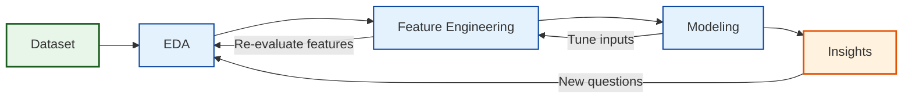
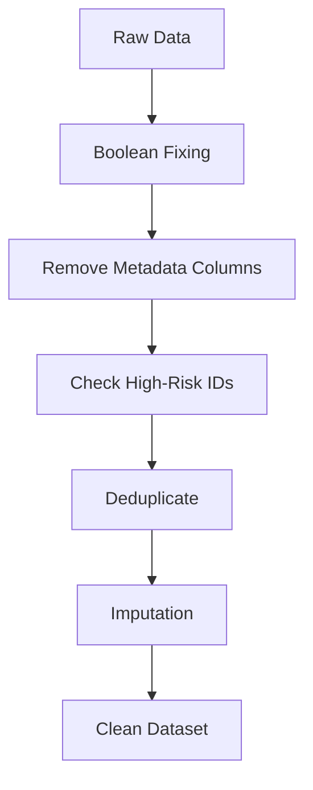

# Compliance Radar
Machine Learning project

## 1. Introduction
This project focuses on understanding organizational compliance, specifically the factors that influence whether a department follows or deviates from company rules. Although the precise rules are not defined, the dataset provides a rich set of operational, structural, managerial, and behavioral indicators that reflect how departments function and how vulnerable they may be to compliance failures.
The main objective of the project is to analyze these indicators to uncover patterns, risk factors, and drivers of non-compliance. By examining both high-risk and standard departments, we aim to identify the organizational characteristics most closely associated with low compliance scores and elevated risk levels.
A secondary goal is to evaluate whether existing internal classifications — such as the high-risk department list — align with measurable compliance performance trends across the organization.

## 2. Project Overview Map

### 3 Dataset overview
We have four tables: departments (the main table distributing departments), high_risk_departments (subset of the main departments table, distrebuting only the departments that are associated with high risk), risk_summary_by_division (shows inforations anout devisions and devisions containing departments), and data_dictionary (gives a detailed meaning of the variables). From the full analysis of our variables we concluded that:

 1.There are many variables that could possibly affect the non-compliance. However, reation_reason, secondary_function, dept_name will bring more noise than     information, therefore, should be dropped at the very early stages.

 2. A non-compliance is: as the dictionary table explains, there already exist two main scores assosiated with compliance and overall risk: compliance_score and  the overall_risk_score. What is the difference between them?

 3. compliance_score is the overall compliance rating, so the compliance was already measures for the chosen department. overall_risk_score includes risks, but not only for non-compliance. Possibly also financial risk, operatrional risk, etc.

### 4. Dataset description
Before beginning with the EDA, the data required significant preparation to ensure accuracy and interpretability:

 **Data Type Standardization**   
Several variables representing yes/no or true/false information were stored as object types instead of numeric or boolean.
These included columns such as remediation_plan_active, executive_support, external_consulting, and others.
To prevent Pandas errors and ensure proper statistical treatment, all these fields were converted to numeric (0/1), which ensures consistency across operations like aggregation, plotting, and modeling.

 **Removal of Irrelevant or Non-Useful Columns**
Certain variables did not contribute meaningful information to the analysis or modeling process. We droped those values because their reasoning is qualitative and not data-driven, because they do not have predictive features, meaning that the model would simply memorize department names, and not learn generalizable patterns. Such variables increase nosie and create overfitting and also it helps avoid accidental data leakage. So we droped:
 1. dept_name
 2. secondary_function
 3. creation_reason
 4. _metadataproject_string
 5. _metadataacademic_year

**Cross-Table Integrity Check (Department Presence Verification)**
For this task, we use two main tabels: departments and high_risk_departmenrs. We validated that every department ID listed as high-risk also appears in the main table. A mismatch would imply missing data or incomplete records. We found that all high-risk departments were present, so no restorative steps were needed.
Nevertheless, we filtered high_risk_departments to keep only IDs present in the main table for safety.

**Combining Risk Labels with the Main Dataset**
To integrate information from both tables, we added a new column: present_in_high_risk_departments, indicating whether each department is high-risk (1) or not (0).
This creates a unified table where risk classification is directly available for modeling and EDA.

**Duplicate Detection and Handling**
We checked for two types of duplication: Full-row duplicates (identical rows) and duplicate department IDs (dept_id repeated across rows) and since dept_id is the unique identifier for each department, duplicates must be resolved carefully. Some duplicates corresponded to high-risk departments. In these cases, we kept the high-risk version of the row. If both duplicates were high-risk or both were non–high-risk, we kept the first occurrence to maintain consistency. After deduplication, each department appears exactly once, eliminating ambiguity in the dataset.

**Final Outcome**
All boolean values are properly formatted, irrelevant or redundant columns are removed, high-risk table fully aligned with the main dataset, risk labels integrated into the main table, duplicate rows resolved with priority rules, the dataset is now clean, consistent, and ready for reliable EDA and modeling.

## 5. Exploratory Data Analysis (EDA)

Before performing modeling or statistical interpretation, we conducted an Exploratory Data Analysis (EDA) to better understand the structure, quality, and behavior of the dataset. EDA helps us to detect data quality issues, as well as identifying outliers and unusual patterns that may distort modeling, understand variable distributions and prepare the dataset for preprocessing and feature engineering, because ML models rely heavily on clean, correctly formatted data, EDA is a critical step before modeling.

  **Outlier handling**
Here, we reviewed all variable types for unrealistic or extreme values. Only a few true otliers were identified and corrected.

 Outliers for numerical variables: 
 1. audir_score_q1: one observation showed values under < 30, which fall outside the normal audit scoring range and this was set to NaN.
 2. overall_risk_score: one outlier found, which was > 100, and was set to NaN
 3. compliance_score_final: 2 outliers, since only those points fall under 20 under around 400 observations, so we flag them.

 Outliers for boolean variables: all boolean field contained only valid binary values, no action required.

 Outliers for categorical variables: here we did a frequency check and it showed that all categories occured with reasonable frequency, > 2%, which means that even the smallest categories are not small enough to combine them with some other categores so we did not modify anything.

*****okay, here we may add the plots from the num variables or somethinng else from that analysys??****

**Logical Consistency Checks**
We wanted to see if there are some logical inconsistencies and we checked cross-variable consistency, especially between audit and compliance scores.
The rule that we examined was if audit scores exist (Q1 or Q2), the final compliance score should also exist. We found 22 inconsistent rows where compliance_score_final is missing, but at least one of audit_score_q1 or audit_score_q2 is present. Of these, 8 departments are flagged as high risk. These 8 were kept, and we added a flag: audit_scores_missing = 1 for them. The remaining 14 rows (non–high-risk) were dropped as inconsistent and low-value.

**Summary statistics**
We did summary stats for numerical columns and we found some very important features:
  1. compliance_score_final ranges from 0 - 100, with 25th percentile at 55. This means the bottom 25% of deparmtens score which if 55 or lower are clearly below the typical compliance leves. Moreover, because we need to define non-compliance, we set non-compliance = compliance_score_final <= 55, focusing on the departments most at risk. Low Compliance: 0 - 55, Moderate Compliance: 55–75, High Compliance: 75-100.
  2. for overall_risk_score, we are most interested in finding very high scores rather than very low. Following the same logic as for the compliance_score_final, we obtain Low Risk: 10 – 20 (up to median), Moderate Risk: 21 – 34 (median to 75th percentile) which are departments that may need attention but are not immediately critical, High Risk: 35 – 100 (above 75th percentile), which are departments likely to have compliance issues, operational exposure, or financial risks.
These classifications will be used further for modeling.

**Missing Data Analysis**
We first observe the overall missingness. Many columns had 36–43% missing values in the raw departments table. We saw that the key ID variables (dept_id, dept_category) are complete, which allowed us to group by category.

A heatmap for visually inspect missing values across al columns.

  Missingness by department category: when we grouped by dept_category we revealed a strong patter, which shows taht Operational_Compliance accounts for the majority of missing data, with an overall missing rate of 83%. Financial_reporting and Risk_management, on the other hand contained far fewer missing values ~ 8%.
This indicates that missigness is not random and it shows that it concentrated in departments dealing with Operational Compliance rules.

 Rows with missing devision have 100% missing analytical data and all 244 rows belong to the Operational_Compliance category. These rows cannot be used for modeling or recovery and are being removed.

  Although most Operational_Compliance records are fully missing, 12 departments in this category have at least some avalible data. However, we cannot determine why they differ fromm other departments based on the current dataset.

  Before we droped rows with fully missing data, we needed to verify whether any appear in the high_risk_departments table. This ensured we do not remove departments that are flaged as high risk and therefore important for our analysis.

  The conclusion from this is that missingness is systematic and not random. It is linked to Operational_Compliance and missing division information. Rows with complitely missing data (missing division), should be dropped, as they cannot contribute meaningfully to analysis or modeling. 
  
  Furthermore, before choosing a strategy for handelling missing values, we needed to determine whether missigness is related to predictive of key outcome variables such as: compliance_final_score and overall_risk_score. If missingness correlates stronly with compliance or risk, then dropping
We can drop the rows with missing division information AND even those present in the high_risk_departments. Why? Because of the following reasoning:

Do all departments with missing values appear in the high_risk_departments? - No. So having all missing values is not equal to being risky.
Do missing overall_risk_score AND compliance_score_final make a department risky? - No (from conclusion 1).
Did these departments appear as risky because of the manual imputation? - Yes. So we initially didn't know anything about these departments and we know that the full missing data does not make a department risky. Therefore, all values for these departments were imputed with values that MADE them risky -> they appear as risky by accident.
Therefore, we should drop all departments with missing division.
To make sure that data missingness is not correlated with risk, we check correlation between missing values and compliance or risk
   
***----maybe we can add the heatmap here??***

**Missing Data Imputation: Two Procedures**
We tested two imputation strategies for departments and high_risk_departments:
**Procedure 1:**  High-risk-aware imputation and for departments that appear in both table we use values from high_risk_departments to fill missing fields in departments when available. 

For remaining missing values:
Numerical → median.
Categorical / boolean → mode.

Apply the same median/mode rules to high_risk_departments.

**Procedure 2:** Pure statistical imputation and Ignore cross-table copying.
For both tables:
Numerical → median.
Categorical / boolean → mode.

**We compared:**
Row-level similarity between corresponding departments. Division-level statistics (e.g., average compliance, risk scores, violations). Distribution shapes of numerical variables.

**Result:**
Both procedures produced very similar division-level aggregates.
However, Procedure 2 preserved the original distributions of numerical variables more faithfully.
We adopted Procedure 2 for final imputation.

**What we did so far**

## 5. Current Findings
(*Only 2–3 early insights — can fill later!*)

## 6. Next Steps
(*Modeling, feature engineering, etc.*)

**FIRST APPROACH**
---
**Predicting Non-Compliance and Building a Risk Framework**

---
1. Goal: the objective of this approach is to understand which departments are at risk of becoming non-compliant and what specific factors drive that risk. Instead of only reporting historical compliance scores, we use machine-learning models to predict the likelihood of non-compliance and to identify the underlying causes. This allows us to move from descriptive analysis (“what happened?”) to proactive decision support (“what will happen?” and “how do we fix it?”).
   
---
2. Training Models to Identify Non-Compliant Departments
   
    We define non-compliance as a department scoring 55 or below, based on the distribution observed in the dataset. Using this threshold, we train three different classification models — Logistic Regression, Support Vector Classifier, and HistGradientBoosting — and evaluate them through cross-validation. Although all three models perform similarly, Logistic Regression stands out for its interpretability and high ROC-AUC. Predictions from this model allow us not only to classify departments but also to understand why each prediction is made.

---
3. Why Logistic Regression Was Selected
   
    Logistic Regression provides clear numerical coefficients that describe how each variable influences the probability of non-compliance. This is crucial for our purposes: we do not want a “black-box” prediction but a method that explains the reasoning behind its decisions. With Logistic Regression, we can see which variables raise the risk, which ones reduce it, and how strongly each contributes. This transparency is the foundation for building targeted, actionable recommendations.

---
4. Creating the Non-Compliance Risk Score

    The model outputs a probability value, which we interpret as the non_compliance_risk. A higher score indicates that a department is close to falling below the compliance threshold, while a lower score means the department is operating safely. Because this score is continuous, it gives a more nuanced picture than a simple “compliant/non-compliant” flag: departments near the boundary can be monitored early, before they officially become non-compliant.

---
5. Understanding What Drives the Risk
   
    Since Logistic Regression produces explicit coefficients, we can identify the strongest drivers of non-compliance for every department. Positive coefficients are variables that increase the risk, while negative coefficients reduce it. The magnitude of each coefficient shows how impactful that variable is. This transforms the model from a prediction tool into a diagnostic tool, allowing us to understand which organizational behaviors contribute the most to compliance failures.

---
6. Turning Insights into Actionable Recommendations
   
    Using the model coefficients, we build a rule-based recommendation layer. For each department, the framework highlights its key risk drivers and specifies which improvements would have the most meaningful impact. The system provides both “single action” recommendations and “combined portfolio” recommendations, depending on how many variables need adjustment. While the recommendation logic can be refined manually for special cases, it already produces clear, actionable guidance tailored to individual departments.

---
7. Final Output of the Framework
   
    The final report generated by this approach includes the predicted compliance status, the non-compliance risk score, the assigned risk category, the improvement target, the top drivers of risk, and a customized action plan. This creates a complete decision-support tool that integrates predictive modeling with practical recommendations. By combining statistical modeling with interpretability, the framework helps the organization identify emerging risks early and intervene in a targeted and effective way.

---

## 7. Tools & Technologies
(*Python, Pandas, Jupyter, etc.*)

## 8. Ethical Considerations
(*Bias, compliance, privacy*)

## 9. Project Structure
(*How the files are organized*)

## 10. Contributors
(*Your team names*)

Machine Learning project – Compliance Radar
