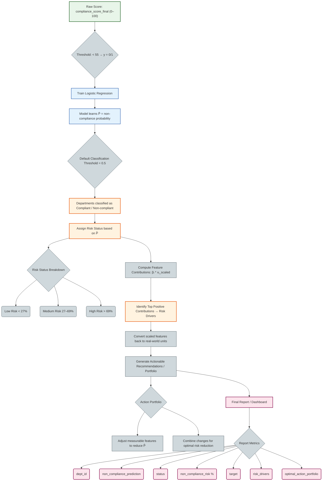

# Compliance Radar

Machine Learning project

---
## Contributors
- Alisa Lamina, 321961
- Maiia Kopalina, 321891
- Filippa Gronberg, 322391
- Evelina Ristovska, 315951

# **Introduction**
This project focuses on understanding organizational compliance, specifically the factors that influence whether a department follows or deviates from company rules. Although the precise rules are not defined, the dataset provides a rich set of operational, structural, managerial, and behavioral indicators that reflect how departments function and how vulnerable they may be to compliance failures.
The main objective of the project is to analyze these indicators to uncover patterns, risk factors, and drivers of non-compliance. By examining both high-risk and standard departments, we aim to identify the organizational characteristics most closely associated with low compliance scores and elevated risk levels.
A secondary goal is to evaluate whether existing internal classifications — such as the high-risk department list — align with measurable compliance performance trends across the organization.

## Project Overview Map

### Dataset overview
We have four tables: `departments` (the main table distributing departments), `high_risk_departments` (subset of the main departments table, distributing only the departments that are associated with high risk), `risk_summary_by_division` (shows information about divisions and the departments they contain), and `data_dictionary` (gives a detailed meaning of the variables). From the full analysis of our variables we concluded that:

- There are many variables that could possibly affect the non-compliance. However, `reation_reason`, `secondary_function`, `dept_name` will bring more noise than     information, therefore, should be dropped at the very early stages.

- A non-compliance is: as the dictionary table explains, there already exist two main scores associated with compliance and overall risk: `compliance_score` and  the `overall_risk_score`. **What is the difference between them?**

- `compliance_score` is the overall compliance rating, so the compliance was already measured for the chosen department.
- `overall_risk_score` includes risks, but not only for non-compliance. Possibly also financial risk, operational risk, etc.

### Dataset description
Before beginning with the EDA, the data required significant preparation to ensure accuracy and interpretability:

 **Data Type Standardization**   
There are several variables representing yes/no or true/false information were stored as object types instead of numeric or boolean.
These included columns such as `remediation_plan_active`, `executive_support`, `external_consulting`, and others.
To prevent Pandas errors and ensure proper statistical treatment, all these fields were converted to numeric (0/1), which ensures consistency across operations like aggregation, plotting, and modeling.

 **Removal of Irrelevant or Non-Useful Columns**
Certain variables did not contribute meaningful information to the analysis or modeling process. We dropped those values because their reasoning is qualitative and not data-driven, because they do not have predictive features, meaning that the model would simply memorize department names, and not learn generalizable patterns. Such variables increase noise and create overfitting and also it helps avoid accidental data leakage. So we dropped:
 1. `dept_name`
 2. `econdary_function`
 3. `creation_reason`
 4. `_metadataproject_string`
 5. `_metadataacademic_year`

**Cross-Table Integrity Check (Department Presence Verification)**
For this task, we use two main tabels: departments and high_risk_departmenrs. We validated that every department ID listed as high-risk also appears in the main table. A mismatch would imply missing data or incomplete records. We found that all high-risk departments were present, so no restorative steps were needed.
Nevertheless, we filtered high_risk_departments to keep only IDs present in the main table for safety.

**Combining Risk Labels with the Main Dataset**
To integrate information from both tables, we added a new column: present_in_high_risk_departments, indicating whether each department is high-risk (1) or not (0).
This creates a unified table where risk classification is directly available for modeling and EDA.

**Duplicate Detection and Handling**
We checked for two types of duplication: Full-row duplicates (identical rows) and duplicate department IDs (dept_id repeated across rows) and since dept_id is the unique identifier for each department, duplicates must be resolved carefully. Some duplicates corresponded to high-risk departments. In these cases, we kept the high-risk version of the row. If both duplicates were high-risk or both were non–high-risk, we kept the first occurrence to maintain consistency. After deduplication, each department appears exactly once, eliminating ambiguity in the dataset.

**Final Outcome**
All boolean values are properly formatted, irrelevant or redundant columns are removed, high-risk table fully aligned with the main dataset, risk labels integrated into the main table, duplicate rows resolved with priority rules, the dataset is now clean, consistent, and ready for reliable EDA and modeling.

# **Methods**

## Exploratory Data Analysis (EDA)

Before performing modeling or statistical interpretation, we conducted an Exploratory Data Analysis (EDA) to better understand the structure, quality, and behavior of the dataset. 
EDA helps us to detect data quality issues, as well as identifying outliers and unusual patterns that may distort modeling, understand variable distributions and prepare the dataset for preprocessing and feature engineering, because ML models rely heavily on clean, correctly formatted data, EDA is a critical step before modeling.

  **Outlier handling**
Here, we reviewed all variable types for unrealistic or extreme values. Only a few true outliers were identified and corrected.

 - **Outliers for numerical variables:**
    1. `audir_score_q1`: one observation showed values under < 30, which fall outside the normal audit scoring range and this was set to NaN.
    2. `overall_risk_score`: one outlier found, which was > 100, and was set to NaN
    3. `compliance_score_final`: 2 outliers, since only those points fall under 20 under around 400 observations, so we flag them.

 - **Outliers for boolean variables:** all boolean fields contained only valid binary values, no action required.

 - **Outliers for categorical variables:** here we did a frequency check and it showed that all categories occured with reasonable frequency, > 2%, which means that even the smallest categories are not small enough to combine them with some other categories so we did not modify anything.


**Logical Consistency Checks**
We wanted to see if there are some logical inconsistencies and we checked cross-variable consistency, especially between audit and compliance scores.
The rule that we examined was if audit scores exist (Q1 or Q2), the final compliance score should also exist. We found **22 inconsistent rows** where `compliance_score_final` is missing, but at least one of `audit_score_q1` or `audit_score_q2` is present. **Of these, 8 departments are flagged as high risk**. These 8 were kept, and we added a flag: `audit_scores_missing` = 1 for them. The remaining 14 rows (non–high-risk) were dropped as inconsistent and low-value.

### Summary statistics

**We did summary stats for numerical columns and we found some very important features:**
  1. **compliance_score_final ranges from 0 - 100, with 25th percentile at 55.** This means the bottom 25% of departments score which if 55 or lower are clearly below the typical compliance leves. Moreover, because we need to define non-compliance, we set non-compliance = compliance_score_final <= 55, focusing on the departments most at risk. Low Compliance: 0 - 55, Moderate Compliance: 55–75, High Compliance: 75-100.
  2. **for overall_risk_score, we are most interested in finding very high scores rather than very low.** Following the same logic as for the compliance_score_final, we obtain Low Risk: 10 – 20 (up to median), Moderate Risk: 21 – 34 (median to 75th percentile) which are departments that may need attention but are not immediately critical, High Risk: 35 – 100 (above 75th percentile), which are departments likely to have compliance issues, operational exposure, or financial risks.
These classifications will be used further for modeling.

### Missing Data Analysis

We first observe the overall missingness. Many columns had 36–43% missing values in the raw departments table. We saw that the key ID variables (dept_id, dept_category) are complete, which allowed us to group by category.

**A heatmap for visually inspect missing values across al columns.**


  - **Missingness by department category**: when we grouped by dept_category we revealed a strong patter, which shows that Operational_Compliance accounts for the majority of missing data, with an overall missing rate of 83%. Financial_reporting and Risk_management, on the other hand contained far fewer missing values ~ 8%.
This indicates that missigness is not random and it shows that it concentrated in departments dealing with Operational Compliance rules.

 - **Rows with missing devision have 100% missing analytical data and all 244 rows belong to the Operational_Compliance category. These rows cannot be used for modeling or recovery and are being removed.**

 - Although most Operational_Compliance records are fully missing, 12 departments in this category have at least some available data. However, we cannot determine why they differ from other departments based on the current dataset.

 - **Before we dropped rows with fully missing data, we needed to verify whether any appear in the high_risk_departments table. This ensured we do not remove departments that are flaged as high risk and therefore important for our analysis.**

 - **We concluded that the missingness is systematic and not random.** It is linked to Operational_Compliance and missing division information. Rows with complitely missing data (missing division), should be dropped, as they cannot contribute meaningfully to analysis or modeling. 
  
  - Before choosing a strategy for handling missing values, we needed to determine whether missigness is related to predictive of key outcome variables such as: `compliance_final_score` and `overall_risk_score`. If missingness correlates strongly with compliance or risk, then dropping
**We can drop the rows with missing division information AND even those present in the high_risk_departments. Why? Because of the following reasoning:**
```
- Do all departments with missing values appear in the high_risk_departments? 
- No. So having all missing values is not equal to being risky.
```
```
- Do missing overall_risk_score AND compliance_score_final make a department risky?
- No (from conclusion 1).
```
```
- Did these departments appear as risky because of the manual imputation?
- Yes. So we initially didn't know anything about these departments and we know that the full missing data does not make a department risky.
```
Therefore, all values for these departments were imputed with values that MADE them risky -> they appear risky by accident.
**Therefore, we should drop all departments with missing division.**

To make sure that data missingness is not correlated with risk, we check correlation between missing values and compliance or risk.


**Missing Data Imputation: Two Procedures**
We tested two imputation strategies for `departments` and `high_risk_departments`:

**Procedure 1:**   High-risk-aware imputation and for departments that appear in both table we use values from `high_risk_departments` to fill missing fields in departments when available. 

For remaining missing values:
Numerical --> median.
Categorical / boolean --> mode.

**Apply the same median/mode rules to high_risk_departments.**

**Procedure 2:**  Pure statistical imputation and Ignore cross-table copying.
For both tables:
Numerical --> median.
Categorical / boolean --> mode.

**We compared:**
Row-level similarity between corresponding departments. Division-level statistics (e.g., average compliance, risk scores, violations). Distribution shapes of numerical variables. Both procedures produced very similar division-level aggregates. However, the histograms showed that Procedure 2 (median/mode) imputation only kept the original shape of the data more faithfully. Because maintaining the integrity of variable distributions is essential for model performance, **Procedure 2 was selected as the final imputation method.**

**Final Imputation Choice and Updated Dataset**
Following this decision, all missing values in both the departments and high_risk_departments tables were filled using the median for numerical fields and the mode for categorical ones. The final dataset retained 424 departments with complete information across all relevant analytical variables. This cleaned dataset now forms the foundation for subsequent modeling steps


### Encoding and Feature Exploration

**Encoding of Categorical Variables**
To prepare the data for the modeling part, the main categorical `variables—dept_category`, `division`, `dept_type`, `location_type`, `team_size`, `reporting_structure`, `primary_function` and `oversight_body—were` converted using one-hot encoding. These variables have no natural order, and the number of categories is manageable, making dummy encoding the most appropriate choice. The dept_id column was kept separate during encoding to avoid being transformed. After encoding, the dataset contained 424 departments and 53 columns, while a non-encoded copy was kept for visualization and interpretation.

**Relationships with Compliance and Risk**
Using the non-encoded version, we explored how variables relate to the two targets: `compliance_score_final` and `overall_risk_score`. 

**Compliance Patterns**
Compliance is most strongly explained by audit performance. `Audit_Score_Q2` (≈0.89) and `Audit_Score_Q1` (≈0.80) dominate all other predictors. Training hours show a mild positive relationship. In categorical patterns, Technology departments, Medium-sized teams, Hybrid reporting structure and International locations tended to score higher on compliance. Departments previously labeled as high-risk showed lower compliance.

**Risk Patterns**
Risk is shaped by classic risk indicators. `Violations_past_3years`, `risk_exposure_operationa`l and `risk_exposure_financial` show strong positive correlations with overall risk, followed by `reporting_gaps_annual`. Lack of improvement commitment and the presence of external consulting also corresponded to higher risk.

**Key Insights for Feature Selection:**
Audit scores and training intensity are the core predictors of compliance, while violations, risk exposures and reporting quality are the strongest predictors of risk. The encoded dataset allows the ML models to use categorical distinctions effectively.

### Multicollinearity check
We are completing a check for multicollinearity between our variables. This is defined as correlation between two or more variables. High multicollinearity might cause problems in statistical stability and future ML modeling. We approach the check by calculating the VIF, a standard statistical measure of multicollinearity. **VIF is computed using the following formula:**

$$
\text{VIF}_k = \frac{1}{1 - R_k^2}
$$

**We define two thresholds:**
- Certain multicollinearity: VIF >= 10
- Possible multicollinearity: VIF >= 5
**For the variables with VIF greater than 10 we will drop these variables, since they are unreliable to use for modeling.**

### Mutual Information – MI
-In order to capture relationships bound linear-ones between variables, we will compute mutual information, and their heatmap matrix. **Mutual Information is essentially a measure of how much the knowledge of one variable reduces the uncertainty of another variable.** 
-Then we compare our variables MI score to the target variable of compliance_score_final. 
-We identify the variables which have a MI score under threshold score 0.01 and drop these variables as they do not have a valuable impact on our target variable `compliance_score_final`, and will therefore not give valuable insights in further modeling and analysis. This enables us to work with a concentrated amount of variables for easier modeling.
-Finally, we rebuilt the working dataset by combining dept_id, the selected MI-based features and the target compliance_score_final. The resulting table has 424 departments and 32 columns, providing a compact, information-rich feature set for modeling, where each remaining predictor has demonstrated a meaningful relationship with compliance.

**MUTUAL INFORMATION VS COMPLIANCE_FINAL**


**What we did so far**


# **Experiments**

**FIRST EXPERIMENTAL APPROACH**
---
**Predicting Non-Compliance and Building a Risk Framework**

---
1. Goal: the objective of this approach is to understand which departments are at risk of becoming non-compliant and what specific factors drive that risk. Instead of only reporting historical compliance scores, we use machine-learning models to predict the likelihood of non-compliance and to identify the underlying causes. This allows us to move from descriptive analysis (“what happened?”) to proactive decision support (“what will happen?” and “how do we fix it?”).
   
---
2. Training Models to Identify Non-Compliant Departments
   
    We define non-compliance as a department scoring 55 or below, based on the distribution observed in the dataset. Using this threshold, we train three different classification models — Logistic Regression, Support Vector Classifier, and HistGradientBoosting — and evaluate them through cross-validation. Although all three models perform similarly, Logistic Regression stands out for its interpretability and high ROC-AUC. Predictions from this model allow us not only to classify departments but also to understand why each prediction is made.
   


Given this combination of performance and interpretability, we select Logistic Regression as the final model. It offers the best balance between predictive quality, stability, and practical interpretability, making it the most suitable choice for our analysis.


There are some signs of overfitting, however, the gap between training and test is still moderate (about 0.026).

**Why Logistic Regression Was Selected?**
```   
Logistic Regression provides clear numerical coefficients that describe how each variable influences the probability of non-compliance.

This is crucial for our purposes: we do not want a “black-box” prediction but a method that explains the reasoning behind its decisions.

With Logistic Regression, we can see which variables raise the risk, which ones reduce it, and how strongly each contributes.

This transparency is the foundation for building targeted, actionable recommendations.
```
---
4. How Logistic Regression Produces the Risk Score 

**Main Idea of the Framework**: As a result of Logistic Regression, the model outputs a probability. The framework uses Logistic Regression to estimate the Non-Compliance Risk P̂. Before producing this probability, the model first computes a raw value called the log-odds or Z-score. This Z-score can range from negative to positive infinity, because it is a linear combination of all input features.

The model computes the log-odds as:
```math
Z = \log\left(\frac{P}{1-P}\right) = \beta_0 + \beta_1 x_1 + \beta_2 x_2 + \cdots + \beta_n x_n
```

The Logistic (Sigmoid) Function converts the Z-score into a probability between 0 and 1:
```math
\hat{P} = \text{Non-Compliance Risk} = \frac{1}{1 + e^{-Z}}
```

To convert this unbounded value into a probability between 0 and 1, Logistic Regression applies the logistic (sigmoid) function.The result P̂ is interpreted as the Non-Compliance Risk, i.e., the model’s estimated probability that a department belongs to the high-risk category.
In practical terms, the non_compliance_risk variable shows how close a department is to becoming non-compliant. If the risk is above a certain threshold (we define it later), the department is approaching the danger zone and should adjust its weakest factor immediately. If the risk is 20% or lower, the department is not in urgent danger but should continue active monitoring and focused improvement.

---
5. Creating the Non-Compliance Risk Score

    The model outputs a probability value, which we interpret as the non_compliance_risk. A higher score indicates that a department is close to falling below the compliance threshold, while a lower score means the department is operating safely. Because this score is continuous, it gives a more nuanced picture than a simple “compliant/non-compliant” flag: departments near the boundary can be monitored early, before they officially become non-compliant.

---

6. Assigning Risk Levels using K-Means Thresholds
   
    To convert the model’s predicted non_compliance_risk into clear categories (Low / Medium / High), we cluster all risk scores using K-Means (k = 3). The algorithm forms three natural groups and gives us three centroids: Low-risk centroid = 0.05, Medium-risk centroid = 0.45, High-risk centroid = 0.90.
  


We convert the three K-Means centroids into practical thresholds by taking the midpoint between them, which gives 0.27 (for the Low-Medium boundary) and 0.69 (for the Medium-High boundary). Using these data-driven cutoffs, departments with risk < 0.27 are classified as Low Risk, those between 0.27 and 0.69 as Medium Risk, and those with risk ≥ 0.69 as High Risk.

---

7. Final Output of the Framework
   
    The final report generated by this approach includes the predicted compliance status, the non-compliance risk score, the assigned risk category, the improvement target, the top drivers of risk, and a customized action plan. This creates a complete decision-support tool that integrates predictive modeling with practical recommendations. By combining statistical modeling with interpretability, the framework helps the organization identify emerging risks early and intervene in a targeted and effective way.


 ----

> [!TIP]
> Interpretation Guide below explains, what the model is telling us about each department and how to use the results for decision-making. 
---

- **Condition 1 — High-Risk & Non-Compliant**

  The department is not meeting compliance requirements, and the model shows there is a very high chance it will fail again if nothing changes.
    This is a critical situation. The recommended actions highlight the quickest and most effective steps to reduce the risk. These are practical changes the department can realistically make right now.

- **Condition 2 — Medium-Risk & Non-Compliant**
  
    The department failed compliance this year, but it is not far from recovering. The risk of failing again is moderate.
    With the improvements listed, the department can realistically move into the Low-Risk zone and meet compliance next cycle. These actions help prevent repeated issues and stabilize performance.

- **Condition 3 — Compliant, but Medium Risk**

    The department passed compliance this year, but the model sees a moderate chance that it could fail next time if nothing improves.
    This is not an emergency, but it requires proactive improvement. By following the recommended actions, the department can move safely into the Low-Risk zone and maintain compliance in the future.

- **Condition 4 — Compliant & Low Risk**

    The department is meeting compliance requirements and has a very low probability of becoming non-compliant next cycle.
    No major changes are needed. This is an example of stable, healthy performance, and the department simply needs to maintain current practices.

---




### Risk-Based Insights from the ML Model
**Linking model outputs back to the original departments**
After training the non-compliance model, we brought the predictions back into the original, non-standardized and non-encoded departments_raw table. This table keeps all variables in their original categorical form (`division`, `location_type`, `team_size`, etc.), which makes interpretation easier. The main ML outputs we merged in were the predicted non-compliance risk (`non_compliance_risk`), the binary non-compliant flag, cluster labels, recommended actions and driver tags. From this enriched table, we built several views to understand how risk is distributed across departments and groups.

**Individual department non-compliance risk profile**
Having computed each department’s predicted non-compliance risk, we can now compare how this risk behaves across divisions and across different categorical characteristics. This gives managers a broader, strategic view of where compliance vulnerabilities tend to concentrate—not just at the individual-department level but across entire organisational segments.
- **For example,** the heatmaps allow us to see patterns such as: Departments located in Urban areas within the Corporate_HQ division show an average non-compliance risk of X%, whereas Urban departments in Regional_Operations show Y%.

- **Insights like these help managers understand which combinations of division and category** (team size, location, department type, oversight body, etc.) are systematically more exposed to risk. Instead of responding to isolated problem departments, managers can identify structural patterns—for instance, whether small teams in Corporate_HQ consistently score higher in risk, or whether certain oversight structures reduce or increase non-compliance in specific divisions.
- **In practice,** this means managers can focus their attention and resources on the exact category-division intersections where risk is highest, ensuring more targeted interventions, better policy design, and more efficient allocation of compliance support.

### Ethical Inconsistencies
**Beyond predicting non-compliance, we also use the model to scan for ethical inconsistencies – cases where a department appears to be treated unfairly given its context.**

- **First, we define a set of positive operational conditions that should, in principle, support good compliance:**
1. managers and supervisors with high experience
2. strong resources and/or extensive compliance training
3. clear oversight and executive support
4. digital compliance systems or structured onboarding programs

- For every department, we compare these **“good practice”** conditions with its predicted non-compliance risk.
If the predicted risk is very high (above 69%) and at least one positive condition is present, we **flag** the case as a potential ethical inconsistency. We then generate a short explanation.
This check does not prove discrimination, but it acts as an early-warning signal. It helps compliance leaders spot departments where high support and high predicted risk don’t match, indicating that the processes, expectations, or rule application may need a closer review.

These cases suggest that the issue may not lie within the department itself but in how compliance expectations, processes or monitoring systems operate around it. **Several practical recommendations emerge:**
1. **Re-evaluate whether the department’s risk assessment is calibrated correctly.**
If a department has strong training, experienced leadership and solid oversight yet still receives an extremely high predicted risk, this may indicate that the current scoring or thresholds are too strict for certain profiles or contexts.
2. **Investigate process or system barriers external to the department.**
High resources and oversight but poor predicted outcomes can point to organisational bottlenecks, unclear procedures, outdated systems or conflicting directives that limit the department’s ability to comply.
3. **Review whether monitoring practices are applied consistently.**
Some departments may be rated more harshly than others despite similar behaviours. Ethical-inconsistency flags help identify potential cases of uneven monitoring, inconsistent application of rules or biased reporting structures.
4. **Provide targeted support—not generic interventions.**
Departments flagged under this check do not need more training or oversight; they need clarity, alignment and removal of structural barriers. Resources should therefore be redirected toward procedural reviews rather than additional compliance activities.
5. **Use flagged cases to improve fairness and transparency.**
These insights can inform fairness audits, guide internal policy reviews and help leadership demonstrate that risk assessments are being used responsibly and ethically.

---

**SECOND EXPERIMENTAL APPROACH**

---

**We created two new variables:**
1. **The Composite Risk Index (CRI)** which measures how strongly a department resembles historically high-risk units based on operational, behavioral, and audit signals.
2. **The Composite Compliance Strength Factor (CCSF)** captures the underlying strength of a department’s compliance practices.
 
By looking at risk and compliance together—not as isolated numbers — we get a more accurate picture of how each department operates and where intervention or support is needed.

---

**Creating the CRI: Composite Risk Index**

---

**1.1 What is the CRI?**
The CRI (Composite Risk Index) is a single, data-driven score that summarizes how risky a department appears based on multiple opperational, behavioral, audit and performace signals, It combines several 'bad' risk factores and several 'good' protective factors into one standardized risk number, scaled 1-100.


**1.2 How do we choose the variables for the CRI and Why Build an Index?**
in order to build a meaningful risk index, every variable must be placed into one of the buckets:
1. Higher value = more risk
2. Worse performance = more chances of compliance failure and these push CRI upward, and visa versa.
3. Using the Driver Indetification Table, we compare risk_avg and normal_average. The higher the risk, the higher the coefficients, the worse the performance of the departments. If the av_risk is negative, or smaller than the normal_risk, that means that the deprtemnts does not belong into the risky category, and it is glaged as low risk department. Moreover, Departmental risk is never driven by a single factor. It emerges from patterns across many activities and behaviors. A combined index makes it possible to compare departments consistently, identify early warning signs, and support better decisions around monitoring and resource allocation. Instead of guessing, we let the data show which signals matter most.

**1.3 Method Overview**
We began by comparing 198 high-risk departments with 226 normal ones to identify meaningful differences. A Random Forest model was then used to learn which variables best separate risky departments from safe ones. Based on statistical patterns and ethical review, variables where higher values increase risk were classified as “bad factors,” while variables associated with stronger compliance were labeled as “good factors.” The model’s feature importances were converted into weights, allowing us to create two composite indicators for every department: a weighted Bad_Score and a weighted Good_Score. These two scores capture how strongly a department resembles past high-risk behavior versus strong compliance behavior.

**1.4 Building the CRI (Composite Risk Index)**
The CRI is calculated by subtracting the Good_Score from the Bad_Score. A department with many risk-raising signals and weak compliance indicators will have a positive CRI, while a department showing strong compliance behavior will have a negative one. The **raw CR**I is then scaled onto a 1–100 range so it can be easily interpreted and compared. Departments naturally fall into three groups—Low, Medium, and High risk—based on the distribution of **CRI_1_100**. In practice, a department with frequent violations and poor audit outcomes will appear at the high end of the scale, while one with strong training, healthy processes, and solid audit scores will appear near the low end.

**1.5 Model Performance**
The Random Forest model performed strongly, achieving 0.94 accuracy on the training set and 0.892 on the test set. The ROC AUC of 0.862 shows that the model is consistently able to distinguish high-risk from normal departments. These results confirm that the CRI is grounded in meaningful patterns and offers a reliable way to evaluate departmental risk.

---

**Creating the CCSF: Composite Compliance Strength Factor**

---

**2.1 Introduction**
After building the CRI to measure risk, we introduce a second variable, which is the CCSF. This looks at the factors that indicate strong or weak compliance performance. Together, CRI and CCSF give a balanced understanding of how each department behaves, allowing managers to evaluate likeliness of risk and compliance equally.

**2.2 Concept and Approach**
The CCSF follows the same framework as the CRI. It is constructed by comparing departments above and below a defined compliance threshold. Earlier analysis using logistic regression showed that a score of 55 is a reliable benchmark separating compliant from non-compliant departments. Using this threshold, we divided 424 departments into 284 compliant and 140 non-compliant groups.
We then examined the mean gaps between these two groups to identify which variables truly distinguish strong compliance from weak compliance. Factors where higher values appeared consistently in compliant departments were treated as “good,” while factors more common in non-compliant departments were labeled as “bad.” From this comparison, we selected the five most meaningful variables on each side, ensuring that the CCSF is built only from measures that are both statistically significant and easy to interpret.

**2.3 Constructing the CCSF**
To estimate how important each factor is, we trained a Random Forest classifier on the compliant vs. non-compliant dataset. The model performed well, showing perfect accuracy on training data and over 90% accuracy on the test set. This confirms that the selected variables meaningfully separate compliant from non-compliant departments.
The model’s Gini importances (tells us which variables are best at separating categories) were turned into weights, separately for good and bad factors, and each set was normalized so that the weights sum to one. These weights allow us to compute two components for every department: a weighted good score and a weighted bad score. 

$$
\text{Total Weighted Score} = \sum_{i=1}^{n} (\text{Weight}_i \times \text{Rating}_i)
$$

**The CCSF_raw** score is simply the difference between these two components. Departments with strong audit performance, experienced managers, and consistent training tend to score higher, while departments showing structural weaknesses or operational risks tend to score lower.
The raw CCSF is then scaled to a 1–100 range for easier interpretation. Across the full dataset, **CCSF scores range from 0 to 100**, with an average around 48. Using this distribution, the departments naturally fall into three groups: low, medium, and high compliance risk.


**2.4 Why CCSF Matters**
While CRI answers the question, “How risky does a department look?”, CCSF answers the question, “How compliant is a department actually?” The CCSF helps managers identify reasons for why compliance may be weak, whether it is due to low training levels, poor audit scores, insufficient oversight, or operational challenges. Employees can also see how their actions directly improve compliance strength, since increases in training, experience, and process quality have visible effects on the CCSF.

**2.5 A linear regression of CRI and CCSF** shows a clear negative relationship: as risk increases, compliance decreases. A linear regression confirms this pattern, with a strong negative correlation of –0.81. This means the two indices move in opposite directions, which is exactly what we expect if both are capturing meaningful organizational behavior.


**When CRI is high and CCSF is low, the message is clear: this department needs attention. Managers can use the two scores together to prioritize audits, target interventions, allocate resources, and plan improvement programs in a strategic way.**

---
**Why is this useful for managers and employees?**

Instead of saying this department is risky, CRI gives a numerical early-warning indicator.

CCSF tells the managers why compliance may be low, and it shows whether the compliance is linked to: lack of training, poor audit scores, operational risk, weak oversight, or other drivers. Because CCSF drops as CRI rises, managers say: "If we reduce the risk, compliance will improve." This makes it easier to allocate budget, train staff, plan audits, and design interventions. Employees can understand the impact of their actions, such as training hours, audit preparation, or operational discipline, which directly raise CCSF and reduce CRI.

In conclusion: if we have high CRI and low CCSF for a department, this tells the staff that they should keep an eye on them and follow them more often.

---

# Results

The main results of our project is the final_report table. We will delve into how this table was built step by step.
We began by training three ML models, and choosing the best performing one (Logistic regression) to distinguish compliant from non-compliant departments. From Logistic Regression we achieved coefficients of non_compliance_risk. Having this probability, we estimate the department's current and prospective risk statuses, derive top five risk driving features, and suggest how to improve them. This is how we obtain the foundation of our final_report table. 

NONCOMPLIANT ((HIGH RISKS)


From department features (location, team size etc.) and non-compliance risk probability we identify ethical inconsistencies and add them to the final report table creating a more advanced description. 

NONCOMPLIANT ((MEDIUM RISKS)


By comparing generally risky departments with normal departments we find patterns that make departments generally risky. Then we create an index CRI which measures likeliness for a department to be generally risky. We assign each department with a status (high, medium, low) based on CRI. Next we match the concept of historical pattern (presence in high_risk departments) with CRI, providing suggestions for managers in each case. 

COMPLIANT (MEDIUM RISKS)


# Final Conclusion


To bring to a close the compliance radar project: we developed an advanced risk assessment system using machine learning methods to look beyond simple compliance score prediction. We used different experimental approaches such as the Logistic Regression, proving non-compliance is not a random mistake, but a clear indicator of deeper structural problems within the organization. We analysed this further, by creating variables, and thus a process distinguishing which variables are mostly affecting risk in departments and equally compliance in departments. The final output of final_reports, gives a global view for managers to pinpoint, grounds and mitigations for well- or poor performing departments.

While our project is a huge step forward in identifying risk, it has limits and leaves a few questions open. The main idea we have not yet approached is the exact cause-and-effect. We know departments with few resources fail more often, but we cannot tell management the optimal level of investment or support actually needed to fix a struggling department. Next steps would be to develop a model that can estimate this for concrete consulting. Another unanswered question is how inherent organizational structure influences risk. Future work could incorporate data enrichment to capture structural variables, followed by network analysis to model the organization, allowing new metrics of departmental centrality to be calculated and tested as predictors of risk.


| Link | Description |
| --- | --- |
| [Figma Visualisation]([https://vk.com/distributedclass_2024](https://www.figma.com/make/xzKM0gK3fdbSRfoWRittTV/Compliance-Tracking-Interface?node-id=0-1&t=EsSUHWPY2Qk1AZox-1)) | UX/UI Visualisation |

Machine Learning project – Compliance Radar
